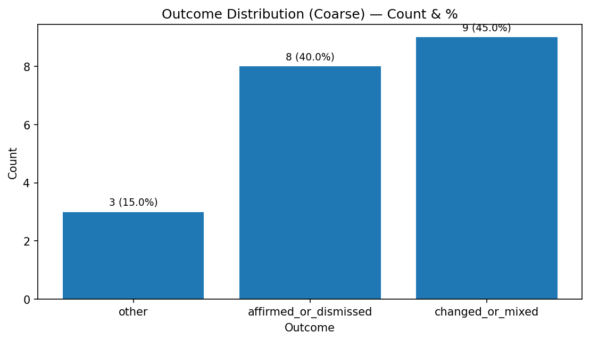
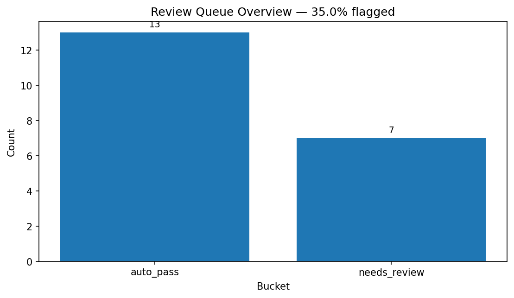
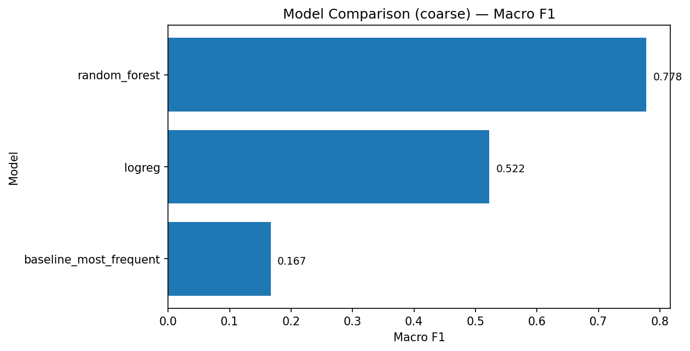

# 👨‍⚖️ courtpipe - Court Opinion Analytics Pipeline

> Building a reliable system for extracting, structuring, and reviewing judicial outcomes at scale.


## Project Overview

This project builds an ETL + analytics pipeline around U.S. court opinions using the CourtListener API.

The pipeline is currently designed as a decision support tool and a classifier. It performs three core functions end-to-end:

1. Collect court opinions for a query (e.g., `corporation`) and enrich them with court and citation metadata  
2. Extract outcome signals from opinion text using rule-based labeling with confidence scoring
3. Triage uncertain cases into a human-in-the-loop review queue, while training baseline ML models for comparison  

The project answers the following question:

> How do outcomes vary across courts, and which cases require human review because outcome extraction is uncertain?


## Scope and Design Philosophy

### What This Project Is

- A reproducible ETL + analytics pipeline
- Focused on opinion-level dispositions, not docket-level procedural status
- Explicitly uncertainty-aware via confidence scores and review flags
- Designed with auditability, explainability, and extensibility in mind

### What This Project Is Not

- A production-grade legal outcome predictor
- A substitute for docket metadata or PACER data
- An attempt to infer the full “true case result” beyond the opinion itself


## Outcome Labels

This project classifies what the court did in the opinion, not the full lifecycle outcome of the case.

### Coarse Outcome (`outcome_code`)

- **0 — other / unclear**
- **1 — affirmed_or_dismissed**
- **2 — changed_or_mixed**  
  (reversed, vacated, remanded, or mixed outcomes)

### Fine Outcome (`outcome_label_fine`, `outcome_code_fine`)

- `affirmed`
- `dismissed`
- `reversed`
- `vacated`
- `remanded`
- `mixed`
- `other`

Each labeled opinion includes:
- An evidence snippet
- A confidence score (heuristic, 0–1)
- A needs_review flag indicating whether human review is recommended


## Human-in-the-Loop Review

Uncertainty is handled explicitly rather than hidden.

Cases are flagged for review when:
- The outcome is `other` or `mixed`
- The confidence score falls below a threshold (default: `0.60`)
- Strong disposition language is missing or ambiguous

Flagged cases are written to:

```
data/processed/review_queue.csv
```

## How to Run the Pipeline

### 1. Clone the repository and install dependencies

Runtime dependencies are declared in `pyproject.toml`. `requirements.txt` only installs that package (`pip install -e .`). It is not a pip freeze.

```bash
git clone <your_repo_url>
cd <repo_name>
python -m venv .venv
source .venv/bin/activate
pip install -e .
```

Tests use the `dev` extra:

```bash
pip install -e ".[dev]"
python -m pytest
```

### 2. Set environment variables

A live extract needs a CourtListener token. Set it in the environment:

```bash
export COURTLISTENER_API_KEY=YOUR_API_KEY
export COURTLISTENER_EMAIL=your@email.com
```

`python-dotenv` also reads a `.env` file in the repository root if you create one. Copy `.env.example` and keep the real values local. `.env` is gitignored. Do not commit API keys.

### 3. Run the full pipeline

```bash
courtpipe run --query "corporation" --max-cases 500
```

(Users can always discover options with:)

```bash
courtpipe --help
courtpipe run --help
```

### 4. IDB settlement evaluation (no CourtListener key)

This command scores whether a federal civil case against a corporate defendant, nature of suit 160, 410, or 850, filed in fiscal years 2010–2021, receives disposition code 13. It reads a local copy of the public FJC file. It does not download inside the evaluation command, and it does not use an API key.

```bash
python scripts/download_idb.py --out data/idb/cv88on.zip
courtpipe evaluate-settlement --idb data/idb/cv88on.zip --report docs/idb/settlement_report.json
```

`data/idb/` is gitignored. The measured run, including pass or fail against the bars, is `docs/idb/RESULTS.md`. The hand audit is pending: the sample is `docs/idb/audit_sample.csv` and the rubric is `docs/idb/AUDIT_RUBRIC.md`. The securities class-action spec is not implemented.


### 5. Appeal-reversal track (track 4, spec only)

This track asks whether a federal court of appeals affirms or changes (reverses, vacates, or remands) a district court ruling, using only information available before the appellate decision. It is a proposal. No code, data extract, or model exists for it, and the build waits for approval. The spec, success bars, and decisions needed are in [`docs/appeal-reversal-spec.md`](docs/appeal-reversal-spec.md).

## Pipeline Stages

### 1. Extract
- Source: CourtListener `/search/` and `/opinions/` endpoints  
- Enrichment includes:
  - Court metadata and jurisdiction
  - Canonical Citation data
  - Opinion text signals (when available)

**Output**
```
data/extracted/raw_data.csv
```


### 2. Transform
- Normalizes types and timestamps
- Cleans court and citation fields
- Extracts opinion text signals
- Applies rule-based outcome labeling from opinion text
- Computes:
  - Confidence score
  - Disposition-zone indicators
  - Review flags

**Outputs**
```
data/processed/processed_data.csv
data/processed/review_queue.csv
```


### 3. Load
- Loads processed data into a pandas DataFrame
- Performs lightweight schema and quality validation


### 4. Modeling
- Baseline classifiers:
  - Logistic Regression
  - Random Forest
- Features:
  - One-hot encoded court identifiers
- Labels:
  - Coarse (`outcome_code`)
  - Fine (`outcome_code_fine`)
- Training skips gracefully if only one class is present

**Outputs**
```
data/model-eval/
├── classification_report_*.csv
├── confusion_*.csv
└── evaluation_summary.json
```


### 5. Visualizations

Generates report-ready charts, including:
- Outcome distributions
- Top courts by volume
- Court Pareto analysis
- Outcomes over time
- Opinion word count distributions

**Outputs**
```
data/outputs/*.png
```


## Validation and Logging

- All pipeline steps log to:
```
logs/pipeline.log
```
- Schema and domain validation occurs after loading
- Model training always writes evaluation artifacts, even if training is skipped


## Repository Structure

```
.
├── courtpipe/           # Installed package + CLI
│   ├── __init__.py
│   ├── __main__.py      # python -m courtpipe
│   └── cli.py           # courtpipe CLI entrypoint
│
├── etl/                 # Extract / Transform / Load stages
├── analysis/            # Modeling and evaluation
├── vis/                 # Visualization generation
├── utils/               # Logging, validation, helpers
│
├── data/
│   ├── extracted/       # Raw extracted opinions (CSV)
│   ├── processed/       # Labeled + cleaned tables
│   ├── model-eval/      # Metrics, confusion matrices
│   ├── outputs/         # Plots
│   └── reference-tables/
│
├── tests/               # Offline pytest suite + synthetic opinion fixture
├── scripts/             # fixture_results.py (offline example metrics)
├── docs/examples/       # Charts and JSON from the fixture run
├── .github/workflows/   # CI: install the package and run pytest
│
├── runs/                # Per-run artifacts (params, logs, outputs)
├── logs/                # Console / pipeline logs
│
├── pyproject.toml       # Packaging + dependencies
├── requirements.txt     # Installs this package; not a pip freeze
├── README.md
└── .gitignore
```


## Data Dictionaries

Reference tables are located in:

```
data/reference-tables/
```

They document:
- Raw extraction fields
- Processed dataset columns
- Outcome codes and meanings


## Results

### Fixture run (no API key)

The tables and charts below were produced by labeling the 20 synthetic snippets in `tests/fixtures/sample_opinions.csv` and training the models in `analysis/model.py` on that table. They are not CourtListener corpus statistics.

Regenerate them from a checkout (no API key, no network):

```bash
python scripts/fixture_results.py --out docs/examples/fixture-run
```

This recording used Python 3.12.3 with the packages resolved from `pyproject.toml` on that run: numpy 1.26.4, pandas 3.0.6, scikit-learn 1.9.1, matplotlib 3.8.4. The held-out split is 6 rows (`test_size=0.3`, `random_state=42`). Logistic regression logged a convergence warning: `lbfgs` stopped at `max_iter=1500`. Read these metrics as a smoke check that labeling, review flags, and evaluation artifacts run offline. They are not a measure of outcome-prediction quality.

`scripts/fixture_results.py` printed:

```text
rows: 20
fine labels: {"affirmed": 4, "dismissed": 4, "mixed": 2, "other": 3, "remanded": 2, "reversed": 3, "vacated": 2}
coarse codes: {"0": 3, "1": 8, "2": 9}
review: 7 needs_review / 13 auto_pass
confidence min/p50/p90/max: 0.25 / 0.80 / 1.00 / 1.00
coarse_baseline_most_frequent: acc=0.3333 f1_macro=0.1667 f1_weighted=0.1667 n_test=6
coarse_logreg: acc=0.5000 f1_macro=0.5222 f1_weighted=0.4944 n_test=6
coarse_random_forest: acc=0.8333 f1_macro=0.7778 f1_weighted=0.8333 n_test=6
fine_baseline_most_frequent: acc=0.1667 f1_macro=0.0476 f1_weighted=0.0476 n_test=6
fine_logreg: acc=0.0000 f1_macro=0.0000 f1_weighted=0.0000 n_test=6
fine_random_forest: acc=0.6667 f1_macro=0.5556 f1_weighted=0.5556 n_test=6
```

Unrounded JSON is in `docs/examples/fixture-run/summary.json` and `docs/examples/fixture-run/evaluation_summary.json`. Coarse code 0 is other/unclear (3 rows), code 1 is affirmed or dismissed (8 rows), and code 2 is changed or mixed (9 rows). Seven of the 20 rows were flagged `needs_review`.

Charts written by `vis/visualizations.py` for that same frame:







### IDB code-13 settlement run

Recorded in `docs/idb/RESULTS.md` from the public civil file. That page states the cohort size and whether the modeling bars passed. The hand audit on `docs/idb/audit_sample.csv` is still pending, so this README does not call the model a settlement predictor. Those figures are not the fixture scores above.

### Live CourtListener run

Not included. A live extract calls the CourtListener API and needs `COURTLISTENER_API_KEY`. Those outputs are gitignored and are not in this repository.

Placeholder: this README does not report corpus-level counts, review rates, or model scores. After you run `courtpipe run`, copy figures from the files that run wrote:

- `data/processed/processed_data.csv`
- `data/processed/review_queue.csv`
- `data/model-eval/evaluation_summary.json`
- `data/outputs/*.png`


## Known Limitations

- Opinion text does not always contain explicit disposition language
- CourtListener `plain_text` availability is inconsistent
- Outcome labeling relies on heuristics, not authoritative docket status
- Models use intentionally simple features (court only)


## Future Extensions

- Active learning using review queue feedback
- Docket-level enrichment
- Embedding-based outcome classification
- Court-specific disposition modeling
- SQL-backed storage (SQLite or Postgres)


